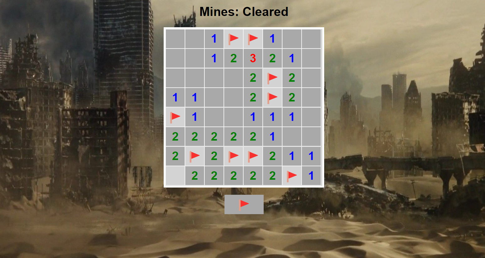
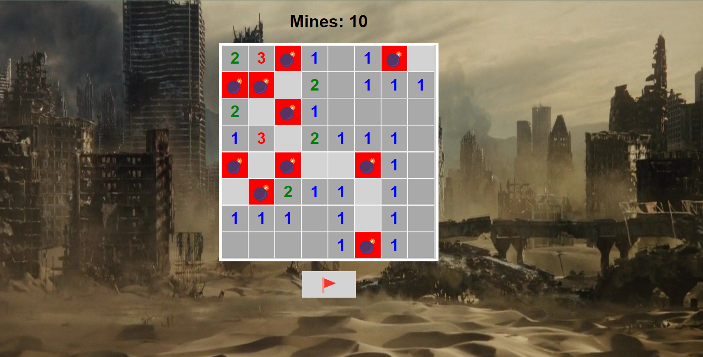

# Bomb Floor

Bomb Floor is a puzzle game inspired by Minesweeper, where the player must uncover tiles on a grid to avoid hidden bombs. The game is built using HTML, CSS, and JavaScript.

## How to Play

- Click on a tile to uncover it.
- Numbers on tiles indicate the number of bombs in adjacent tiles.
- Use the numbers to strategically uncover tiles and avoid bombs.
- Uncover all non-bomb tiles to win the game.

## Demo

You can play the game [here](https://sithumsankajith.github.io/Bomb-floor/).

## Screenshots

## Technologies Used

- HTML
- CSS
- JavaScript

## License

This project is licensed under the MIT License - see the [LICENSE](LICENSE) file for details.
